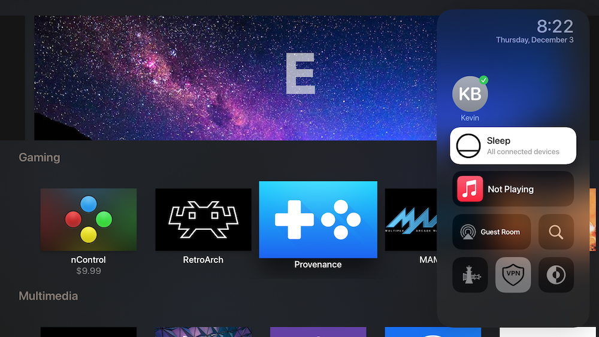

# TVControlCenter
Research &amp; Documentation on implementation of control center bundles on tvOS 13+

Control Center on tvOS is split up into 3 components: TVSystemMenuService (An invisible application), TVSystemMenuUI.framework (a private framework) and a series of bundles (stored in /System/Library/TVSystemMenuModules)

  <br/>

## TVSystemMenuService

This application is the control center of well... control center, it handles the actual UI that is displayed to the user and the handling of which modules are available and visible.

### 14+ Changes

In tvOS 14+ there are some nice changes to deal with toggle states and tint coloring and some (currently unresearched stuff) of your modules in TVSMButtonViewController, specifically:

```Objective-C
@property (nonatomic,copy) UIColor * titleTintColor API_AVAILABLE(tvos(14.0));
@property (nonatomic,copy) UIColor * subtitleTintColor API_AVAILABLE(tvos(14.0));
@property (nonatomic,copy) UIColor * symbolTintColor API_AVAILABLE(tvos(14.0));
@property (nonatomic,retain) TVSMProgressView * progressView API_AVAILABLE(tvos(14.0));
@property (nonatomic,copy) TVSMCAPackageView * caPackageView API_AVAILABLE(tvos(14.0));
@property (assign,nonatomic) BOOL toggledOn API_AVAILABLE(tvos(14.0));   

```

***Most importantly you need to keep your images black & white, and the black content needs to be identical to what you want to display. In addition they are no longer scaled by Apple, they must be the proper size they will be displaying in, something like 100x100 or lower)***

### View controller hierarchy

The root view controller is a [_UIViewServiceViewControllerOperator](https://github.com/lechium/tvOS142Headers/blob/c7696f6d760e4822f61b9f2c2adcd18749700fda/System/Library/PrivateFrameworks/UIKitCore.framework/_UIViewServiceViewControllerOperator.h)

We are interested in 
```Objective-C
    UIViewController* _localViewController;
```

Which ends up being [TVSMHostViewController](https://github.com/lechium/tvOS142Headers/blob/master/Applications/TVSystemMenuService/TVSMHostViewController.h)

In the _localViewController view we are particulary interestd in [_mainViewController](https://github.com/lechium/tvOS142Headers/blob/master/Applications/TVSystemMenuService/TVSMMainViewController.h)
```Objective-C
    TVSMMainViewController *_mainViewController;
```

Digging deeper yet [_gridContainerViewController](https://github.com/lechium/tvOS142Headers/blob/master/Applications/TVSystemMenuService/TVSMButtonGridContainerViewController.h)
```Objective-C
    TVSMButtonGridContainerViewController *_gridContainerViewController;
```

Almost there! [_collectionViewController](https://github.com/lechium/tvOS142Headers/blob/master/Applications/TVSystemMenuService/TVSMButtonGridCollectionViewController.h)
```Objective-C
    TVSMButtonGridCollectionViewController *_collectionViewController
```

cycript example of hooking at a specific module through the the view hierarchy:

```Objective-C

root# cycript -p TVSystemMenuService

cy# self = [UIApp keyWindow ].rootViewController
    #"<_UIViewServiceViewControllerOperator: 0x122935400>"
cy# local = [self valueForKey:@"_localViewController"] //TVSMHostViewController
    #"<TVSMHostViewController: 0x121e5fd90>"
cy# main = [local mainViewController ] //TVSMMainViewController
    #"<TVSMMainViewController: 0x121d9f610>"
cy# grid = [main valueForKey:@"_gridContainerViewController"] //TVSMButtonGridContainerViewController
    #"<TVSMButtonGridContainerViewController: 0x121d15ac0>"
cy# collection = [grid valueForKey:"_collectionViewController"] // TVSMButtonGridCollectionViewController
    #"<TVSMButtonGridCollectionViewController: 0x121d879f0>"
cy# sections = [collection numberOfSectionsInCollectionView: collection.collectionView]
    2
cy# items =[collection collectionView: collection.collectionView numberOfItemsInSection: sections-1]
    6
cy# ip = [NSIndexPath indexPathForItem: items-1 inSection: 1]
    #"<NSIndexPath: 0x93cc60848b2fff37> {length = 2, path = 1 - 5}"
cy# mod =  [collection _moduleAtIndexPath: ip]
    #"<NTVVPNModule: 0x282caf360>"
```

### Modules

Doing very broad cursory coverage of each component, this information is hot off the presses!

_TVSMModuleInfo calls +(id)_defaultModuleDirectories which currently only points towards '/System/Library/TVSystemMenuModules'

This is an ideal place to inject so we can get our own bundles loaded, interestingly enough putting our bundles directly in /System/Library/TVSystemMenuModules removes the need to do any code injection to get our bundles to load with no extra work needed.

## TVSystemMenuUI.framework

The private framework that contains all the classes we will be inheriting from to create a bundle for control center.

I took the header dump from the basic 'Sleep Module' to determine how these bundles work, it is a perfect template to create our own simple bundle off of.

Header file

```Objective-C

#import <TVSystemMenuUI/TVSMActionModule.h>

@interface TestModule : TVSMActionModule

+(long long)buttonStyle;
-(id)contentViewController;
-(void)handleAction;
-(BOOL)dismissAfterAction;

@end

```

Implementation file

```Objective-C
#import <UIKit/UIKit.h>
#import <Foundation/Foundation.h>
#import <TVSystemMenuUI/TVSMButtonViewController.h>
#include "TestModule.h"

@implementation TestModule


//button style 0 = small square, button style 1 = medium sized rectangle, 2 = Full size button

+(long long)buttonStyle {
    return 2; // Full size button
}

-(id)contentViewController {

    TVSMButtonViewController *buttonController = [super contentViewController];
    [buttonController setTitleText:@"Hello World"];
    [buttonController setSecondaryText:@"(we really out here)"];
    [buttonController setStyle:2];
    NSString *packageFile = [[self bundle] pathForResource:@"Package" ofType:@"png"];
    [buttonController setImage:[UIImage imageWithContentsOfFile:packageFile]];
    return buttonController;
}
-(void)handleAction {

  //handle your action here

}

-(BOOL)dismissAfterAction {
    return TRUE;
}

@end
```

## Samples

There are header dumps of all the afformentioned existing plugins available on this repo, a mostly working theos template & a sample project

in the checkra1n folder is the source of the exact bundle that is used in checkra1n for tvOS

[Video Preview](TVControlCenter.mp4)

## Create your own bundle package

1. Install theos (if you haven't already)
2. Drop tvos_control_center_bundle.nic.tar into $THEOS/templates/
3. run $THEOS/bin/nic.pl
4. choose tvos/control_center_bundle
5. Profit

The sample project this creates should give you everything you need to get going, including a sample control file that will depend upon 'com.nito.tvcontrolcenter'
